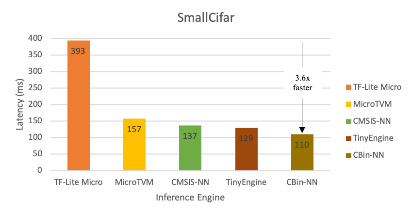
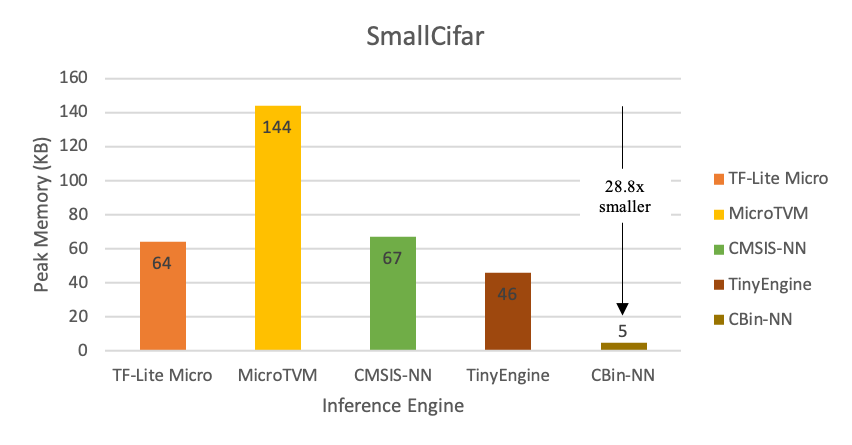

## Welcome to the CBin-NN Inference Engine

Binarization is an extreme quantization technique that is attracting research in the Internet of Things (IoT) field, as it radically reduces the memory footprint of deep neural networks, without a correspondingly huge accuracy drop. In order to support an effective deployment of BNNs, we propose CBin-NN, a library of layer operators that allows building simple yet flexible convolutional neural networks (CNNs) with binary weights and activations. CBin-NN is platform-independent, thus portable to virtually any software-programmable device.

### Why TinyML?

- Latency: because TinyML enables on-device analytics without the need to send data to a server, edge devices can process data and provide inference with low latency.

- Bandwidth: Since data doesn't need to be sent to the server all the time, less Internet bandwidth is required.

- Energy efficient: the farther we move data, the more energy we consume. Processing data on chip is orders of magnitude more efficient. 

- Reliability: Processing data on the device is inherently more reliable than a connection with the cloud. Intelligence shouldn’t have to depend on weak internet connection.

- Privacy: Keeping the data on the edge device reduces the risk of sensitive data being compromised.

### CBin-NN 

* We introduce the CBin-NN inference engine. This is an open-source framework for running BNNs on resource-constrained devices, namely Microcontroller units (MCUs). 

* CBin-NN primarily targets 32-bit Cortex-M devices (ARM). However, the library is written in platform-independent C and can run BNN models on bare-metal devices, so it is intended to be seamlessly portable to most software-programmable edge devices. 
  - The Supported operators are shown in the below Table:
  
|Operator | Input | Weight | Output |
| --- | --- | --- | --- |
QBConv2D                           | 8-bit quantized | 32-bit packed   | 32-bit packed
QBConv2D                           | 8-bit quantized | 32-bit packed   | 32-bit packed
QBConv2D_Optimized_PReLU           | 8-bit quantized | 32-bit packed   | 32-bit packed
QQConv2D                           | 8-bit quantized | 8-bit quantized | 32-bit packed
QQConv2D_Optimized                 | 8-bit quantized | 8-bit quantized | 32-bit packed
QQConv2D_Optimizd_PReLU            | 8-bit quantized | 8-bit quantized | 32-bit packed
BBConv2D                           | 32-bit packed   | 32-bit packed   | 32-bit packed
BBConv2D_Optimized                 | 32-bit packed   | 32-bit packed   | 32-bit packed
BBConv2D_Optimized_PReLU           | 32-bit packed   | 32-bit packed   | 32-bit packed
BBPointwiseConv2D                  | 32-bit packed   | 32-bit packed   | 32-bit packed
BBPointwiseConv2D_Optimized        | 32-bit packed   | 32-bit packed   | 32-bit packed              
BBPointwiseConv2D_Optimized_PReLU  | 32-bit packed   | 32-bit packed   | 32-bit packed
BMaxPool2D                         | 32-bit packed   |       -         | 32-bit packed
BMaxPool2D_Optimized               | 32-bit packed   |       -         | 32-bit packed
BBFC                               | 32-bit packed   | 32-bit packed   | 32-bit packed
BBFC_Optimized                     | 32-bit packed   | 32-bit packed   | 32-bit packed
BBFC_Optimized_PReLU               | 32-bit packed   | 32-bit packed   | 32-bit packed          
BBQFC                              | 32-bit packed   | 32-bit packed   | quantized (8, 16, 32 bit) 
BBQFC_Optimized                    | 32-bit packed   | 32-bit packed   | quantized (8, 16, 32 bit)
BBQFC_Optimized_PReLU              | 32-bit packed   | 32-bit packed   | quantized (8, 16, 32 bit) 

* We show that CBin-NN is faster and more memory efficient than existing inference engines by benchmarking with the STM32F746 MCU and the CIFAR10 dataset:
  
  
  
  

* Our future goal is to design a dedicated optimizer for BNNs to mitigate the performance degradation due to the gradient mismatch problem, especially for large datasets such as ImageNet. In this way, an architecture designed specifically for mobile and edge devices such as MobileNet, which suffer from dramatic accuracy degradation due to it depthwise convolutional layers, can achieve comparable accuracy results to its 8-bit, full-precision counterparts.

### Support or Contact

For more information about the library, see our [IEEE EDGE 2022 paper](https://scholar.google.com/citations?view_op=view_citation&hl=en&user=x3TEgPQAAAAJ&citation_for_view=x3TEgPQAAAAJ:qjMakFHDy7sC) or [contact us](mailto:f.sakr@qmul.ac.uk?subject=CBin-NN%20Assistance) for assistance.

